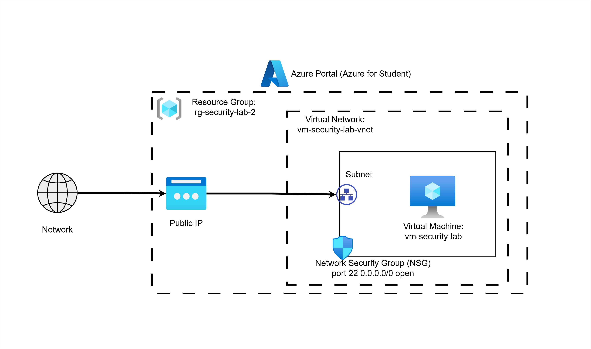
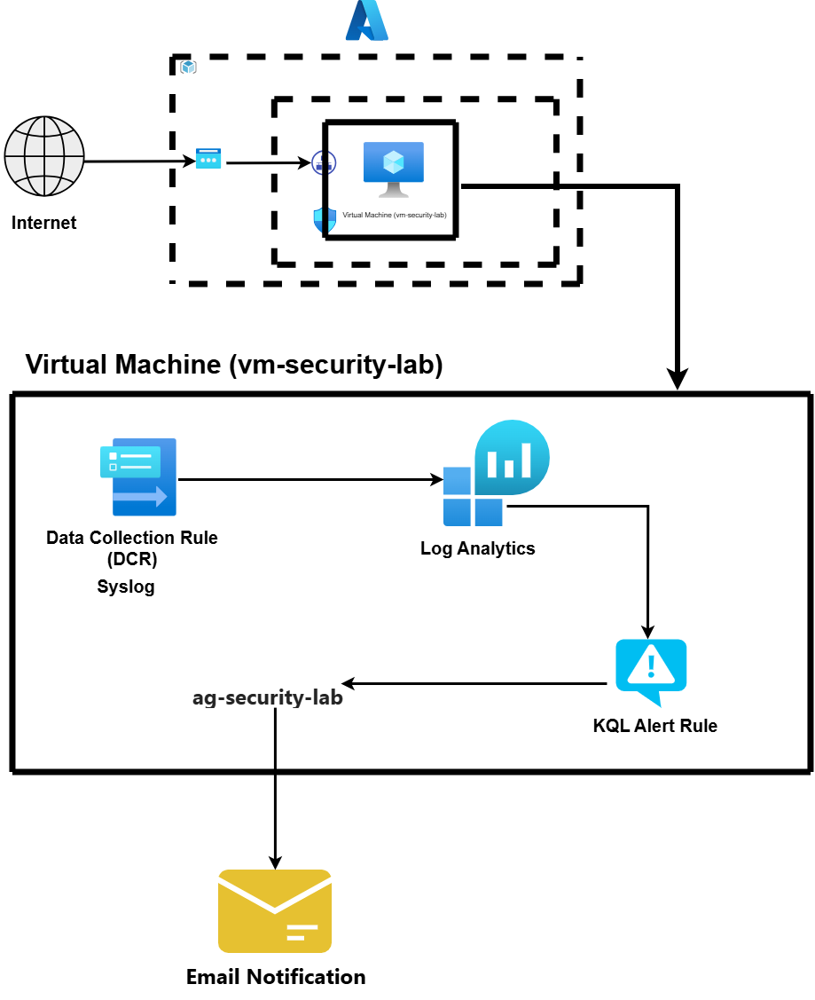

# Architecture Diagram

## Overview
This architecture represents the initial deployment of the Secure Cloud Environment with Attack Detection project in Microsoft Azure.

---

## Components
- **Internet** – Represents public external access
- **Public IP** – Provides internet-reachable access to the virtual machine
- **Network Security Group (NSG)** – Controls inbound and outbound traffic rules
- **Virtual Network (VNet)** – Provides private network segmentation within Azure
- **Subnet** – Logical subdivision of the virtual network
- **Virtual Machine (Ubuntu)** – Main compute resource used for deployment, hardening, monitoring, and attack simulation

---

## Initial Traffic Flow
The initial configuration allows:
- Public internet access to the VM
- SSH (Port 22) access from any source (`0.0.0.0/0`)

---

## Security Concern
Allowing SSH from any source creates a significant attack surface and exposes the VM to:
- Brute-force login attempts
- Unauthorized access attempts
- Public scanning and reconnaissance

---

## Planned Security Improvements
This architecture will be improved in later stages by:
- Restricting SSH access to trusted IPs only
- Applying host-based hardening
- Enabling centralized logging and monitoring
- Configuring attack detection and alerting

---

## Final Hardened Architecture

After completing all security phases, the environment was 
significantly improved:

### Security Improvements Applied
- SSH restricted to trusted IPs only via NSG rules
- Password-based SSH authentication disabled
- Key-based authentication enforced
- RBAC applied — least privilege access model
- Linux Syslog collection via dedicated DCR
- KQL-based detection rule in Azure Monitor
- Email alerting via Action Group

### Monitoring Pipeline

### Attack Simulation Outcome
72 brute force attempts detected and alerted on.
0 successful logins — hardening controls proven effective.
