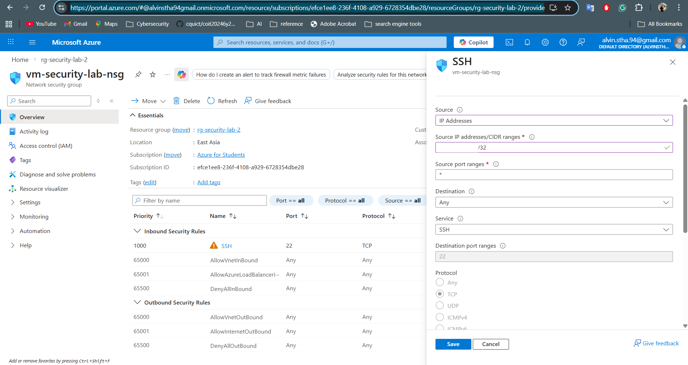
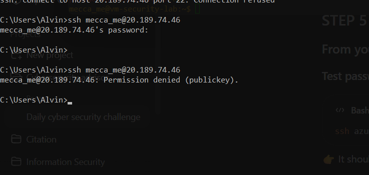
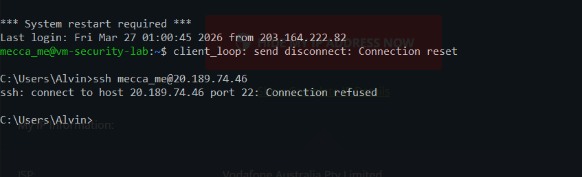

# Security Hardening

## Objective
This document outlines the initial hardening steps applied to the Linux virtual machine after deployment.

---
 
## 1. System Updates
Updated installed packages and applied available patches.

### Command Used
```bash
sudo apt update && sudo apt upgrade -y
```


### Security Benefit
Applying updates reduces exposure to known vulnerabilities and improves the overall baseline security posture of the system.

---

## 2. Host-Based Firewall (UFW)
A host-based firewall was enabled to provide an additional security layer beyond Azure NSG controls.

### Commands Used
```bash
sudo apt install ufw -y
sudo ufw allow ssh
sudo ufw enable 
sudo ufw status
```


---

## 3. Brute-Force Protection (Fail2Ban)

Fail2Ban was installed and enabled to detect repeated failed authentication attempts and help mitigate brute-force login attacks.

### Commands Used
```bash
sudo apt install fail2bash -y
sudo systemctl enable fail2ban
sudo systemctl start fail2ban
sudo systemctl status fail2ban
```


### Security Benefit

Fail2Ban improves SSH access security by identifying suspicious authentication failures and reducing exposure to repeated unauthorized login attempts.

---

## 4. SSH Access Restriction via Azure NSG

Azure NSG inbound rules were updated to allow SSH access only from trusted public IP address(es).

### Previous State
- **Source:** `Any`
- **Port:** `22`

### Updated State
- **Source:** `Trusted Public IP(s)`
- **Port:** `22`



### Security Benefit
This reduced public exposure and limited administrative access to known network locations.

### Key Learning
Restricting SSH by public IP reduces the attack surface, but does not guarantee that only a single trusted device can authenticate.

---

## 5. SSH Key-Based Authentication

After initial testing, it was identified that restricting SSH access by public IP alone was not sufficient to uniquely control which device could log into the virtual machine.

### Observation
Although Azure NSG rules were updated to allow SSH only from a trusted public IP address, multiple devices behind the same internet connection were still able to reach the VM.

### Security Insight
Azure NSG rules evaluate the **public source IP address**, not the individual internal device behind the network. As a result, NSG restriction reduced exposure to the wider internet, but did not fully guarantee device-level trust.

### Hardening Action
To strengthen administrative access security:

- SSH key-based authentication was implemented
- A trusted SSH key pair was generated on the client device
- The public key was added to the VM's `~/.ssh/authorized_keys`
- Password-based SSH login was disabled

### Commands Used

#### a. Generate SSH Key Pair on Client Device
```bash
ssh-keygen -t ed25519 -C "azure-lab-key"
```

#### b. Secyre Authorized Keys File
```bash
chmod 700 ~/.ssh/authorized_keys
chmod 600 ~/.ssh/authorized_keys
```

#### c. Add Public Key to Authorized Keys File
```bash
Add Public Key to Authorized Keys File
```

#### d. Test SSH Key-Based Login from Client Device
```bash
ssh -i ~/.ssh/id_ed25519 azureadmin@<public-ip>
```
OR
- For this, no password is asked; you should put the key password
```bash
ssh azureadmin@<public-ip>
```

### Best Practice Note

The SSH private key was generated and stored on the trusted client device only. The VM stores only the corresponding public key for authentication.

### Security Benefit
This ensured that only devices holding the correct private SSH key could authenticate successfully, even if other devices shared the same public internet connection.

### Key Learning
Restricting network access and controlling authentication are separate security layers. Both are required for stronger remote administrative access security.

---

## 6. Password-Based SSH Login Disabled

After implementing SSH key-based authentication, password-based SSH login was disabled to reduce exposure to brute-force and credential-based attacks.

### Commands Used
#### 1. Update SSH Configuration
```bash
sudo nano /etc/ssh/sshd_config
```
##### Expected Configuration
- PermitRootLogin no
- PasswordAuthentication yes


#### 2. Restart SSH Service
```bash
sudo systemctl restart ssh
```

#### 3. Validate Effective SSH configuration
```bash
sudo grep -R "PasswordAuthentication" /etc/ssh/
sudo sshd -T | grep passwordauthentication
```

##### Expected Output
- PasswordAuthentication yes

### Validation Test
A login attempt using the old password-based method was performed from the client device.

```bash
ssh azureuser@<public-ip>
```
##### Result
- Permission denied (publickey)

### Security Interpretation

This confirmed that password-based authentication was no longer accepted and that the VM now required a valid private SSH key for access.

### Security Benefit

Disabling password-based SSH login significantly reduces the risk of:

- Brute-force password attacks
- Credential guessing
- Unauthorized access using stolen or weak passwords

### Password Authentication Denied


### SSH Connection Refused


---


