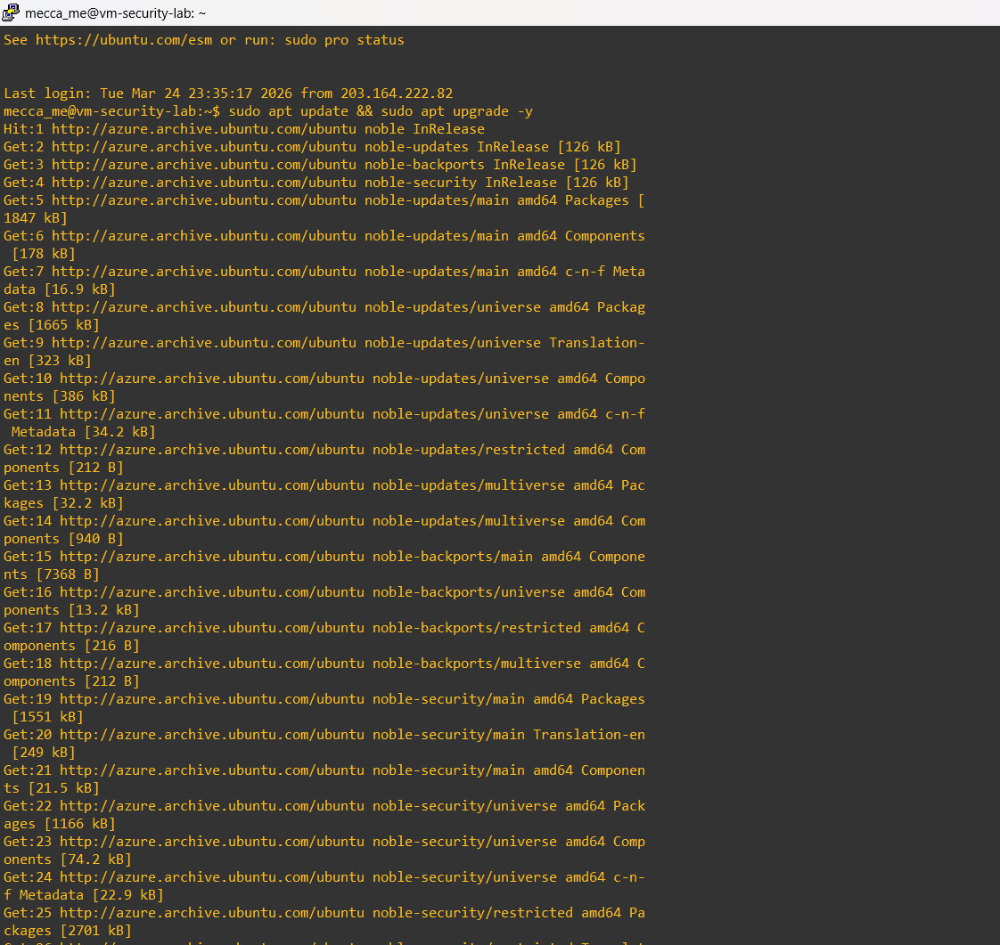
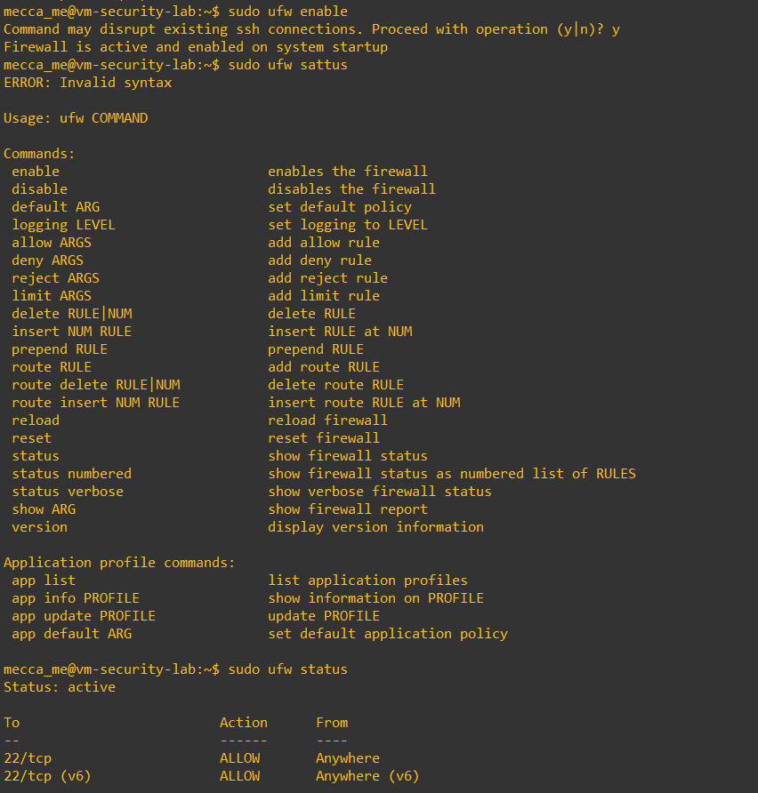
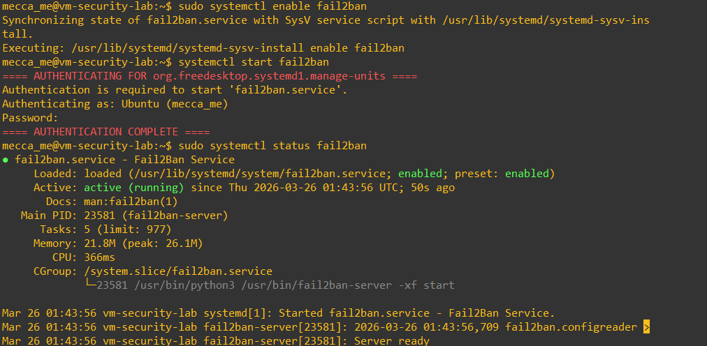
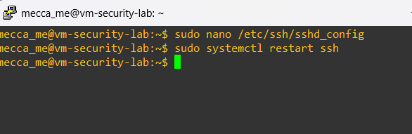
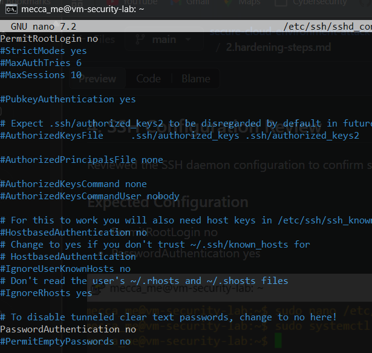

# Security Hardening

## Objective
This document outlines the initial hardening steps applied to the Linux virtual machine after deployment.

## 1. System Updates
Updated installed packages and applied available patches.

### Command Used
```bash
sudo apt update && sudo apt upgrade -y
```


## 2. Host-Based Firewall (UFW)
Enabled UFW and allowed SSH access.

### Commands Used
```bash
sudo apt install ufw -y
sudo ufw allow ssh
sudo ufw enable 
sudo ufw status
```


## 3. Brute-Force Protection (Fail2Ban)

Installed and enabled Fail2Ban to help detect and mitigate repeated unauthorized login attempts.

### Commands Used
```bash
sudo apt install fail2bash -y
sudo systemctl enable fail2ban
sudo systemctl start fail2ban
sudo systemctl status fail2ban
```


## 4. SSH Configuration Review

Reviewed the SSH daemon configuration to confirm secure baseline settings.

### Expected Configuration
- PermitRootLogin no
- PasswordAuthentication yes




## 6. SSH Configuration Troubleshooting and Override Resolution

During the process of disabling password-based SSH login, it was observed that password authentication remained active even after updating the main SSH configuration file.

## Troubleshooting Commands Used

```bash
sudo grep -R "PasswordAuthentication" /etc/ssh/
sudo sshd -T | grep passwordauthentication
```

## 7. SSH Access Restriction via Azure NSG

Azure NSG inbound rules were updated to allow SSH access only from trusted public IP address(es).

### Previous State
- **Source:** `Any`
- **Port:** `22`

### Updated State
- **Source:** `Trusted Public IP(s)`
- **Port:** `22`

### Security Benefit
This reduced public exposure and limited administrative access to known network locations.

---

## 8. SSH Key-Based Authentication

After initial testing, it was identified that restricting SSH access by public IP alone was not sufficient to uniquely control which device could log into the virtual machine.

### Observation
Although Azure NSG rules were updated to allow SSH only from a trusted public IP address, multiple devices behind the same internet connection were still able to reach the VM.

### Security Insight
Azure NSG rules evaluate the **public source IP address**, not the individual internal device behind the network. As a result, NSG restriction reduced exposure to the wider internet, but did not fully guarantee device-level trust.

### Hardening Action
To strengthen administrative access security:

- SSH key-based authentication was implemented
- A trusted SSH key pair was generated on the client device
- The public key was added to the VM's `~/.ssh/authorized_keys`
- Password-based SSH login was disabled

### Security Benefit
This ensured that only devices holding the correct private SSH key could authenticate successfully, even if other devices shared the same public internet connection.

### Key Learning
Restricting network access and controlling authentication are separate security layers. Both are required for stronger remote administrative access security.
