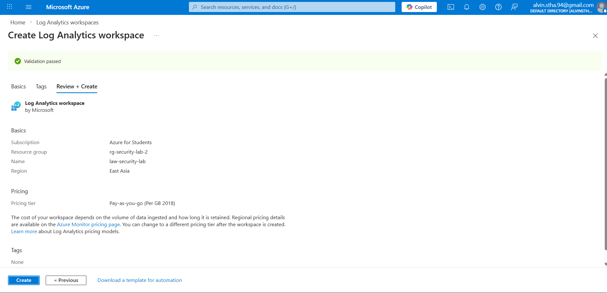
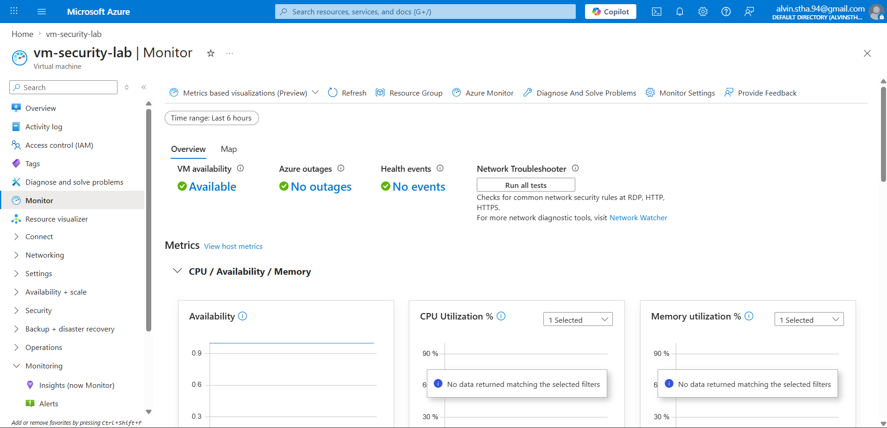
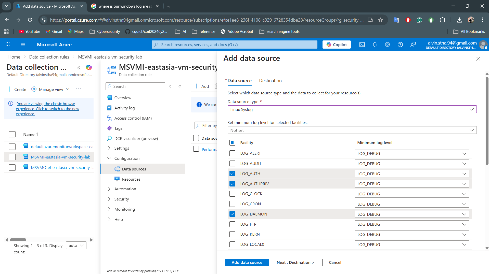
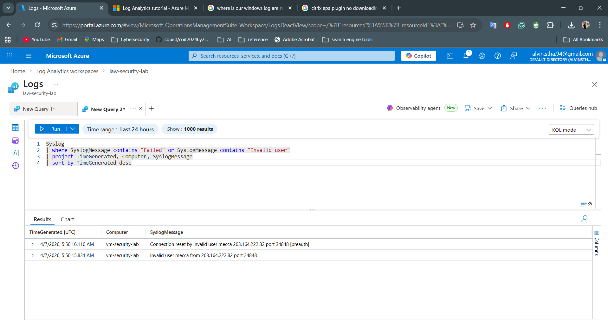
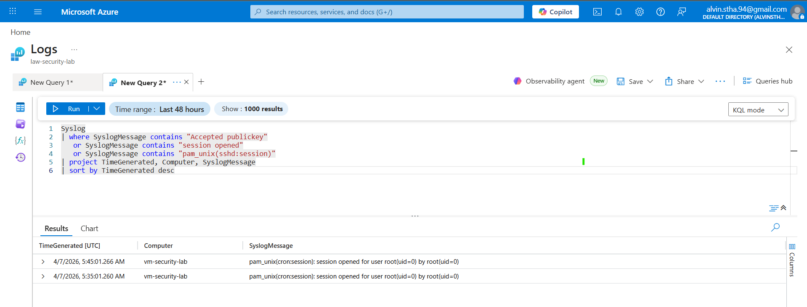

# Log Collection and Monitoring Setup

## Objective
The objective of this phase was to enable centralized log collection and monitoring for the Linux virtual machine in Microsoft Azure. This provides visibility into authentication activity, suspicious access attempts, and system events for security monitoring and detection purposes.

---

## 1. Log Analytics Workspace

A Log Analytics Workspace was created in Azure to act as the centralized destination for collected logs.

### Configuration
- **Workspace Name:** `law-security-lab`
- **Purpose:** Centralized storage and analysis of security and system logs

### Security Benefit
This provides a central platform for:
- Log retention
- Query-based investigation
- Detection logic
- Future alerting and monitoring

### Evidence

---

## 2. Azure Monitor / VM Monitoring Integration

The Linux VM was connected to Azure Monitor through Data Collection Rules (DCR), allowing telemetry and log data to be sent into the Log Analytics Workspace.

### Monitoring Components Enabled
- VM Insights
- Performance Counters
- Linux Syslog

### Security Benefit
This established the monitoring pipeline required for cloud-based security visibility and log analysis.

### Evidence

---

## 3. Linux Syslog Collection

Linux Syslog collection was configured through Azure Data Collection Rules to ingest authentication and system-related events from the VM.

### Selected Facilities
- `LOG_AUTH`
- `LOG_AUTHPRIV`
- `LOG_DAEMON`

### Minimum Log Level
- `LOG_INFO`

### Why These Were Selected
These facilities are relevant for:
- SSH authentication attempts
- Invalid user login attempts
- Authentication/session events
- System service activity

### Security Benefit
This enabled the collection of security-relevant Linux logs needed for attack detection and monitoring.

### Key Learning
> Cloud monitoring requires both:
- a log storage destination (Log Analytics Workspace)
- a properly configured collection pipeline (Data Collection Rules + Linux Syslog)

### Evidence

