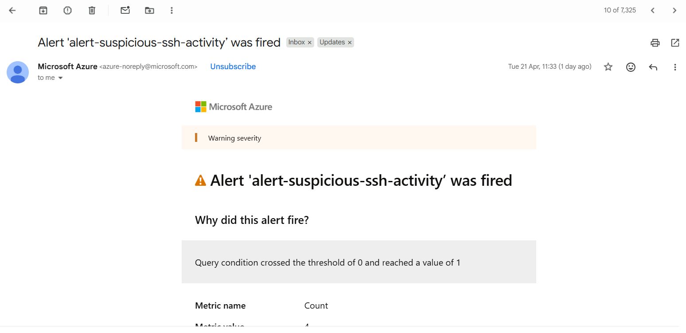

# Azure Alert Rule Configuration

## Overview

This phase focused on converting collected Linux Syslog data into actionable security alerts using Azure Monitor. The objective was to detect suspicious SSH authentication activity and receive real-time email notifications.

During implementation, an important tuning issue was discovered: the initial alert logic generated false positives from non-security background system processes. Query refinement was then performed to ensure alerts only trigger for real authentication-related events.

---

# Objectives

- Create Azure Monitor log-based alert rules
- Detect suspicious SSH login attempts
- Send email notifications using Action Groups
- Reduce false positives
- Tune KQL detection logic
- Improve alert accuracy

---

# Environment

| Component | Value |
|----------|------|
| Cloud Provider | Microsoft Azure |
| VM OS | Ubuntu Linux |
| Workspace | law-security-lab |
| Alert Type | Log Search Alert Rule |
| Notification Method | Email |
| Detection Source | Syslog |

---

# Alert Rules Created 
- *Name:alert-suspicious-ssh-activity*

#Action Group Created 
- *Name:ag-security-lab*

# Notification Method
- Email

---

# Initial Detection Rule

## Original KQL Query

```kql
Syslog
| where SyslogMessage contains "Invalid user"
   or SyslogMessage contains "Connection reset by invalid user"
   or SyslogMessage contains "Failed"
```

## Final KQL Query

```kql
Syslog
| where Facility == "auth" or Facility == "authpriv"
| where SyslogMessage contains "Invalid user"
    or SyslogMessage contains "Failed password"
    or SyslogMessage contains "Connection reset by invalid user"
| project TimeGenerated, Facility, SyslogMessage
```

---

# Why This Query Was Used
- This logic restricts alerts to authentication events only. 
- It prevents unrelated daemon/system failures from generating false alerts.

# Validation Result
The alert successfully triggered and email notifications were received after suspicious authentication activity was detected.



# Security Value
This phase demonstrates:
- Real-time threat detection
- Alert engineering
- False positive tuning
- Security monitoring maturity

# Final Outcome
Successfully implemented Azure security alerting for suspicious SSH activity using Linux Syslog data and KQL.
