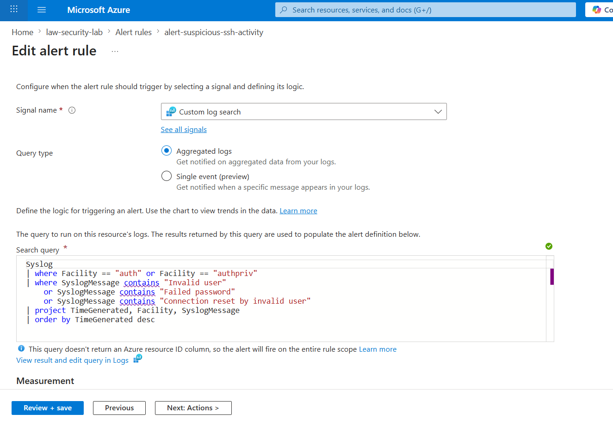

# Troubleshooting & Limitations 

## Overview
This documentation captures real issues encountered during the implementation of alerting and monitoring in the Azure security lab environment. Each problem is documented with its root cause, resolution, and key learning. Reflecting the kind of investigative and problem-solving work required in real cloud security environments. 

---

## 1. False Positive Alerts - Alert Firing Every Hour with No Login Activity

### Observed Behavior
After configuring the **alert-suspicious-ssh-activity** alert rule and action group, alert notifications were received approximately every hour, even when no SSH login attempts were made. 

### Investigation 
Running the following query in Log Analytics revealed two distinct types of messages being matched: 
```kql
Syslog
| where SyslogMessage contains "Invalid user"
    or SyslogMessage contains "Failed password"
    or SyslogMessage contains "Failed"
| project TimeGenerated, Facility, SyslogMessage
| order by TimeGenerated desc
```

### Results showed two categories of messages:

| Facility | Message | Legitimate Alert? |
|----------|----------|---------|
| auth | Invalid user mecca from 203.x.x.x port 62625 |  Yes - Real SSH attempt |
| daemon | FuEngine failed to add device /sys/devices/LNXSYSTM... | No - Azure backgroup process |

---

## 2. Root Cause Analysis

The initial KQL query used a broad **contains "Failed"** condition with no facility filter. This matched messages from the **daemon** facility, specifically Microsoft Azure's **FuEngine** background agent, which continuously logs hardware-related messages containing the word "Failed". These messages have no relation to authentication or SSH activity. 

### What is Daemon?
In Linux, a daemon is a background process that runs automatically without user interaction. Examples include **sshd** (SSH listener), **systemd** (service manager), **FuEngine** (Azure VM hardware agent). Daemons log to the **daemon** syslog facility, completely separate from authentication logs, which go to **auth** and **authpriv**.

### Resolution 
The KQL detection query was narrowed to only inspect authentication facilities:
**Original Query**
```kql
Syslog
| where SyslogMessage contains "Invalid user"
   or SyslogMessage contains "Connection reset by invalid user"
   or SyslogMessage contains "Failed"
```
**Refined Query**

```kql
Syslog
| where Facility == "auth" or Facility == "authpriv"
| where SyslogMessage contains "Invalid user"
    or SyslogMessage contains "Failed password"
    or SyslogMessage contains "Connection reset by invalid user"
| project TimeGenerated, Facility, SyslogMessage
| order by TimeGenerated desc
```


### Why Not Create a Separate DCR without Daemon?
An alternative considered was creating a new DCR that only collected **auth** and **authpriv** facilities, excluding the daemon entirely. However, this approach was rejected because it follows bad security practice. 

The correct principle in security logging is:
> "Collect broadly, alert narrowly."
- Collect as many log sources as possible; daemon logs may be needed for future forensic investigation (e.g., a compromised background process)
- Alert only on specific, well-defined conditions using precise KQL filters
Filtering at the query level (KQL) preserves full log visibility while eliminating false positives in alerting.

### Key Learning
> Good detection logic is not just about what you detect, it is about what you deliberately exclude. A security alert that fires constantly for the wrong reasons trains people to ignore it. This is called alert fatigue and is a real problem in SOC environments.
---

## 3. Duplicate Destination Error in Data Collection Rule (DCR)

### Problem
When attempting to add Linux Syslog as a data source inside the existing **MSVMI-eastasia-vm-security-lab** DCR, the following error appeared, and the Syslog entry would disappear after saving:
> Update Error - 'Destinations' destination names must be unique (case-insensitively). Duplicate names: vmInsightworkspace

### Root Cause 
The **MSVMI-eastasia-vm-security-lab** DCR was automatically created by Azure VM Insights when VM monitoring was first enabled. It already contained a destination named **vmInsightworkspace** pointing to the Log Analytics workspace.
When attempting to add Syslog, Azure tried to create another destination with the same name inside the same DCR — which Azure does not allow. This caused the Syslog entry to silently fail and disappear.

**Understanding Azure DCR Architecture**

| Component | Definition | Example |
|----------|----------|---------|
| Data Source | What logs are collected |  Linux Syslog, Performance Counters |
| Destination | Where logs are sent | Log Analytics Workspace |
| Resource | Which machine sends the logs | vm-security-lab |

Adding a new Data Source (Syslog) does not require creating a new Destination. The existing workspace destination should be reused.
### Resolution 

Rather than modifying the auto-generated VM Insights DCR, a dedicated new DCR was created specifically for Syslog collection:

Name: ```dcr-syslog-security-lab```
Data Source: Linux Syslog (```auth```, ```authpriv```, ```daemon``` at ```LOG_INFO``` and above)
Destination: ```law-security-lab``` (existing Log Analytics workspace)
Resource: ```vm-security-lab```

### Key Learning
> Azure auto-provisions monitoring infrastructure when features like VM Insights are enabled. Security engineers must understand the difference between auto-generated and manually configured resources to avoid conflicts. Always audit existing DCR configurations before adding new data sources.

## 4.Inconsistent Alert Triggering — Alerts Not Appearing in Portal
 
### Problem
 
The alert rule `alert-suspicious-ssh-activity` was configured correctly and suspicious activity was visible in Log Analytics query results, but alerts were not consistently appearing in the Azure Monitor Alerts panel.
 
### Root Cause
 
The alert rule depended on Syslog data flowing through the DCR pipeline. Due to the duplicate destination error described above, Linux Syslog was **not consistently being ingested** into the Log Analytics workspace. The alert query ran correctly but returned no results because the underlying data was missing.
 
This created a silent failure — the detection logic was correct but the data pipeline feeding it was broken.
 
### Resolution
 
Once a dedicated Syslog DCR was created and confirmed working (verified via `Syslog | take 10` query returning results), alert triggering became consistent and email notifications were received successfully.
 
### Key Learning
 
> A detection system has multiple layers — each one must work correctly for the end-to-end pipeline to function. The layers are:
>
> 1. **Data Collection** (DCR + Syslog agent on VM)
> 2. **Log Storage** (Log Analytics Workspace)  
> 3. **Detection Logic** (KQL query)  
> 4. **Alerting** (Alert Rule + Action Group)  
> 5. **Notification** (Email)
>
> A failure at any layer breaks the entire pipeline — and the failure may not be obvious. Always validate each layer independently before assuming the issue is in the detection logic itself.
 
---
 
## Summary of Key Lessons Learned
 
| # | Lesson | Context |
|---|--------|---------|
| 1 | Collect broadly, alert narrowly | DCR should collect all relevant facilities; KQL should filter precisely |
| 2 | Broad string matching causes false positives | `contains "Failed"` without facility filter matched daemon messages |
| 3 | Azure auto-provisions DCRs — understand them before modifying | VM Insights creates its own DCRs that can conflict with manual configuration |
| 4 | Destination names must be unique within a DCR | Reuse existing destinations rather than creating duplicates |
| 5 | Validate data pipeline end-to-end before debugging logic | Missing log ingestion causes silent alert failures |
| 6 | Alert fatigue is a real security risk | False positives that fire constantly cause analysts to stop paying attention |
 
---
 
## Final Outcome
 
After resolving these issues, the complete monitoring and alerting pipeline was successfully validated:
 
- Linux Syslog data flowing from VM into Log Analytics workspace  
- KQL detection query correctly identifies SSH authentication events  
- Alert rule firing only on genuine authentication-related activity  
- Email notifications received via Action Group  
- False positives eliminated through facility-based filtering successfully demonstrated:
This reflects realistic challenges faced in cloud security environments.
