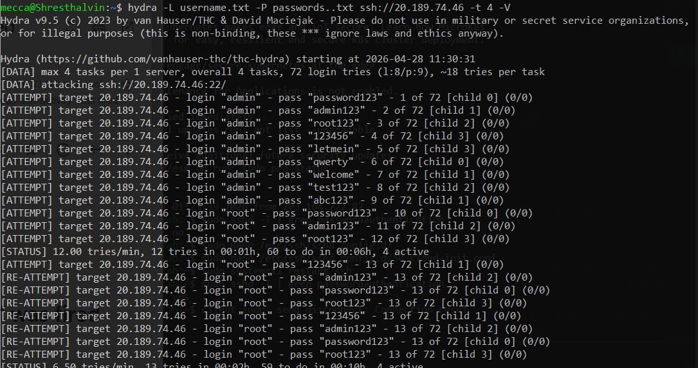
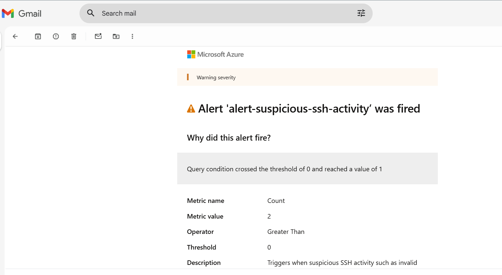

# Attack Simulation — SSH Brute Force

## Overview

This phase simulates a real-world SSH brute force attack against the Azure Linux VM to validate the end-to-end detection and alerting pipeline built in previous weeks. The simulation uses Hydra, an industry-standard penetration testing tool used by security professionals and in certifications such as CEH and CompTIA Security+.

The objective was not to gain access — it was to generate realistic attack traffic and confirm that the monitoring, detection, and alerting systems respond correctly.

---

## Objectives

- Simulate a realistic SSH brute force attack against the VM
- Validate that Linux Syslog captures authentication failure events
- Confirm that the KQL detection query identifies the attack
- Confirm that Azure Monitor fires the alert rule
- Confirm that email notification is received via Action Group
- Re-harden the environment after simulation is complete

---

## Environment

| Component | Value |
|---|---|
| Target VM | vm-security-lab |
| Target IP | 20.189.74.46 |
| Target Port | 22 (SSH) |
| Attack Tool | Hydra v9.5 |
| Attack Machine | Windows PC via WSL (Ubuntu) |
| Simulation Date | April 28, 2026 |

---

## MITRE ATT&CK Mapping

| Tactic | Technique | ID |
|---|---|---|
| Credential Access | Brute Force: Password Guessing | T1110.001 |
| Initial Access | External Remote Services (SSH) | T1133 |

---

## Pre-Simulation Preparation

### Step 1 — Temporarily Re-enable Password Authentication

SSH brute force requires password authentication to be enabled on the target. Since the VM was hardened in Week 2 to disable password-based SSH login, it was temporarily re-enabled for the purpose of this simulation.

```bash
sudo nano /etc/ssh/sshd_config.d/50-cloud-init.conf
```

Changed:
```
PasswordAuthentication no   →   PasswordAuthentication yes
```

Restarted SSH daemon:
```bash
sudo systemctl restart ssh
```

### Step 2 — Prepare Attack Wordlists

Two wordlist files were created on the attack machine to simulate common credential stuffing attempts:

**usernames.txt**
```
admin
root
test
ubuntu
user
guest
alvin
mecca
sysadmin
```

**passwords.txt**
```
password123
admin123
root123
123456
letmein
qwerty
welcome
test123
abc123
```

These represent the most commonly attempted credentials in real-world SSH brute force campaigns.

---

## Attack Execution

### Command Used

```bash
hydra -L usernames.txt -P passwords.txt ssh://20.189.74.46 -t 4 -V
```

### Parameters Explained

| Parameter | Meaning |
|---|---|
| `-L usernames.txt` | Use username wordlist |
| `-P passwords.txt` | Use password wordlist |
| `ssh://20.189.74.46` | Target SSH service |
| `-t 4` | Run 4 parallel threads |
| `-V` | Verbose — show each attempt |

### Attack Output

```
Hydra v9.5 starting at 2026-04-28 11:19:13
[DATA] max 4 tasks per 1 server, overall 4 tasks, 72 login tries (1:8/p:9)
[DATA] attacking ssh://20.189.74.46:22/
[ATTEMPT] target 20.189.74.46 - login "admin" - pass "password123" - 1 of 72
[ATTEMPT] target 20.189.74.46 - login "admin" - pass "admin123" - 2 of 72
[ATTEMPT] target 20.189.74.46 - login "root" - pass "password123" - 10 of 72
...
0 of 1 target completed, 0 valid password found
Hydra finished at 2026-04-28 11:33:04
```

**Total attempts:** 72 (8 usernames × 9 passwords)
**Successful logins:** 0
**Duration:** ~14 minutes

### Evidence


---

## Detection Results

### Logs Captured in Log Analytics

The following KQL query was run against `law-security-lab` during and after the attack:

```kql
Syslog
| where Facility == "auth" or Facility == "authpriv"
| where SyslogMessage contains "Invalid user"
    or SyslogMessage contains "Failed password"
| project TimeGenerated, Facility, SyslogMessage
| order by TimeGenerated desc
| take 20
```

### Sample Log Entries Captured

| Time (UTC) | Facility | Message |
|---|---|---|
| 4/28/2026 1:30:35 AM | auth | Failed password for invalid user admin from 203.164.222.82 port 10548 |
| 4/28/2026 1:30:35 AM | auth | Failed password for invalid user admin from 203.164.222.82 port 10524 |
| 4/28/2026 1:30:32 AM | auth | Invalid user admin from 203.164.222.82 port 10548 |
| 4/28/2026 1:30:32 AM | auth | Invalid user admin from 203.164.222.82 port 10526 |
| 4/28/2026 1:30:31 AM | auth | Disconnected from invalid user admin 203.164.222.82 port 10608 |

All events correctly captured under the `auth` facility — confirming the KQL facility filter is working as intended.

### Evidence


---

## Alert Validation

### Alert Fired

The `alert-suspicious-ssh-activity` rule fired successfully during the attack:

| Field | Value |
|---|---|
| Alert Name | alert-suspicious-ssh-activity |
| Severity | Sev2 |
| Fired Time | April 28, 2026 — 11:30 UTC |
| Metric Value | 14 events detected |
| Threshold | Greater than 0 |
| Trigger Condition | Query condition crossed threshold |

### Email Notification Received

An email notification was delivered to the configured address via the `ag-security-lab` Action Group within minutes of the attack commencing.

### Evidence


---

## Post-Simulation Hardening

Immediately after the simulation, password authentication was disabled again:

```bash
sudo nano /etc/ssh/sshd_config.d/50-cloud-init.conf
```

Changed back to:
```
PasswordAuthentication no
```

Restarted SSH:
```bash
sudo systemctl restart sshd
```

### Verification

Hydra was re-run to confirm password auth was disabled:

```bash
hydra -L usernames.txt -P passwords.txt ssh://20.189.74.46 -t 4 -V
```

Result:
```
[ERROR] target ssh://20.189.74.46:22 does not support 
password authentication (method reply 4)
```

This confirms the hardening control is back in place and the attack surface is closed.

---

## Key Findings

| Finding | Detail |
|---|---|
| Detection worked | All 72 brute force attempts were captured in Syslog |
| Alert fired correctly | Rule triggered within minutes of attack start |
| Email delivered | Notification received via Action Group |
| No successful logins | 0 of 72 attempts succeeded |
| Hardening confirmed | Password auth re-disabled and verified post-simulation |

---

## Security Value Demonstrated

This simulation validates the complete security monitoring pipeline:

1. ✅ **Data Collection** — Syslog captured all authentication events via DCR
2. ✅ **Log Storage** — Events stored in Log Analytics workspace
3. ✅ **Detection Logic** — KQL query correctly identified brute force pattern
4. ✅ **Alerting** — Azure Monitor alert rule fired on threshold breach
5. ✅ **Notification** — Email delivered via Action Group
6. ✅ **Hardening** — No successful compromise despite 72 attempts

---

## Key Learning

> A security monitoring system is only valuable if it is tested. Running this simulation proved that every layer of the pipeline — from log collection through to email notification — functions correctly under real attack conditions. It also confirmed that the Week 2 hardening controls (disabling password authentication) are effective: despite 72 credential attempts, zero logins succeeded.
