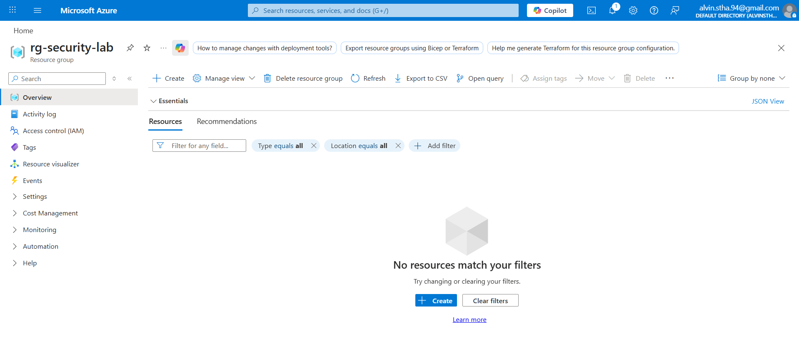
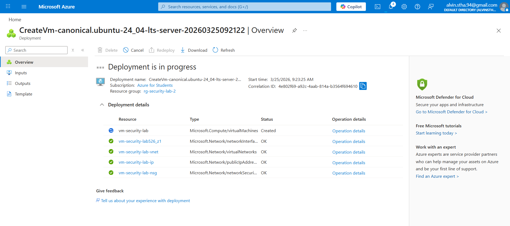
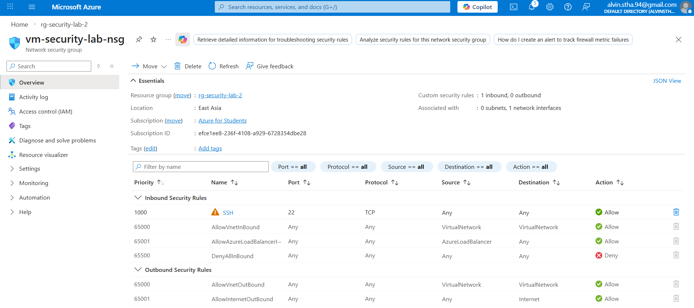
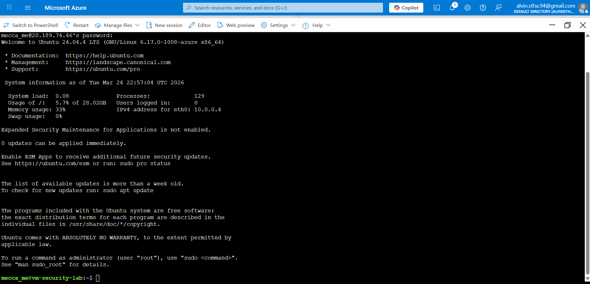

# Secure Cloud Environment with Attack Detection (Azure)

## Overview
This project demonstrates the design, deployment, and security hardening of a cloud environment in Microsoft Azure, including attack detection and monitoring capabilities. 

The environment was built under Azure subscription constraints, requiring adaptation to policy-enforced region restrictions and resource limitations. These constraints reflect real-world cloud scenarios where engineers must design secure systems within operational boundaries.

The project focuses on identifying misconfigurations, applying security controls, implementing logging and alerting, and simulating attack scenarios to validate detection and response mechanisms.

## Objectives
- Deploy a cloud-based VM
- Identify security misconfiguration
- Apply security hardening techniques
- Implement logging and monitoring
- Simulate and detect attacks.

## Day 1 Setup
- Created Resource Group

- Deployed Linux VM

- Configured SSH (port 22) to allow public access (0.0.0.0/0) to simulate a common cloud misconfiguration

## Initial Security Issue
This configuration exposes the VM to potential brute-force attacks and unauthorized access attempts from the public internet.
- SSH (port 22) is open to 0.0.0.0/0 (public access)

## Challenges & Resolutions

### Issue: Azure Deployment Failure due to Region Policy
During initial deployment, resource creation failed because Azure subscription policies restricted the allowed regions.

### Root Cause
The Azure for Students subscription enforces policies that limit which regions resources can be deployed in.

### Resolution
- Switched deployment to an allowed region (e.g., Australia Southeast / East US), in this case I used Asia East
- Standardized all resources within the permitted region

### Key Learning
Cloud environments often enforce policy constraints. Understanding and adapting to these restrictions is critical in real-world deployments.

## Architecture
The architecture diagram and technical explanation for the environment are available here:
- [Architecture Documentation](/1.Architecture/architecture.md)

## Setup Steps
[Setup Steps](./2.Setup/Setup-steps.md)

## Security Issues Identified
(To be added)

## Mitigations Applied
(To be added)

## Detection & Monitoring
(To be added)

## Incident Response
(To be added)

## Project Roadmap

- [x] Day 1: Azure environment deployment
- [x] Day 1: Initial security misconfiguration identified
- [x] Day 1: SSH connectivity verified
- [ ] Week 2: Linux VM hardening
- [ ] Week 3: Azure NSG restriction and network hardening
- [ ] Week 4: Identity and Access Management (RBAC)
- [ ] Week 5: Logging and monitoring with Azure Monitor / Log Analytics
- [ ] Week 6: Alerting and detection rule creation
- [ ] Week 7: Attack simulation and evidence collection
- [ ] Week 8: Final documentation and interview demo preparation

## Skills Demonstrated

- Microsoft Azure resource deployment
- Virtual machine provisioning and access management
- Network Security Group (NSG) configuration
- Cloud misconfiguration identification
- Linux remote administration via SSH
- Cloud troubleshooting under subscription policy constraints
- Security-focused technical documentation
